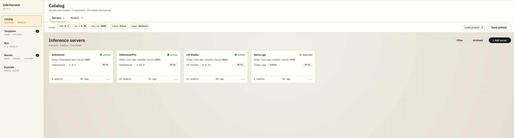
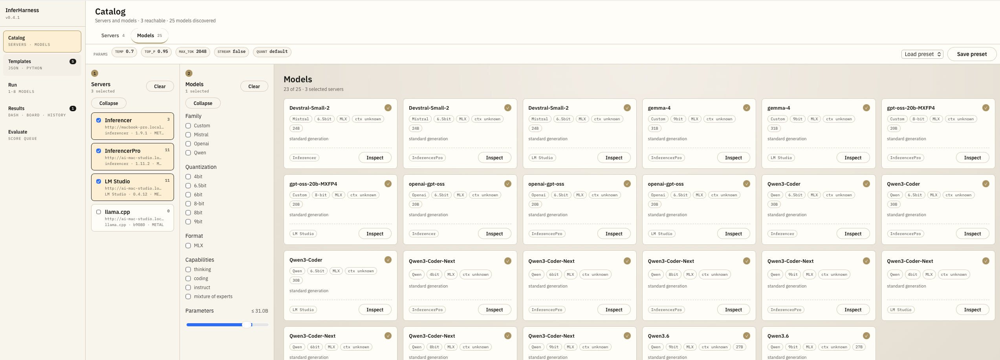
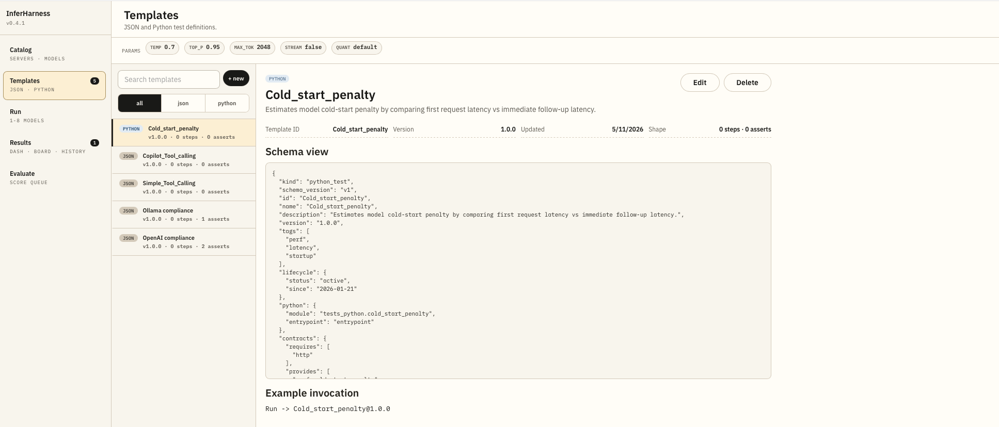
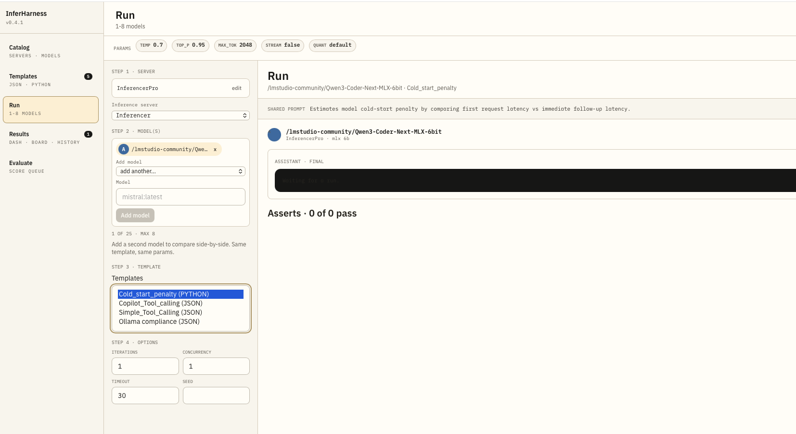
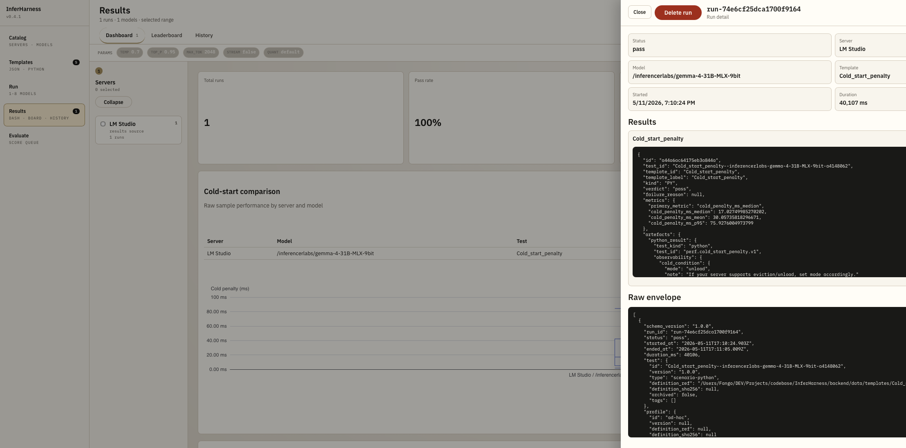

# InferHarness

**Local-first testing and evaluation harness for LLM inference servers and open-weight models.**

---

## Why InferHarness Exists

InferHarness was initially developed to investigate compatibility and tool-calling behaviour differences across local inference servers and open-weight LLMs. The project progressively evolved into a local-first evaluation and testing environment designed to compare inference behaviour, validate workflows and analyse model responses in practical AI engineering scenarios.

All data stays on your machine. There are no cloud dependencies, no accounts, and no telemetry — just a browser-based interface backed by a local SQLite database.

---

## Main Features

**Server & model management**
Register inference servers, discover available models automatically, and maintain a curated catalog with metadata (format, quantization provider, capabilities, base model name).

**Test execution**
Run single tests, suites, and parameter sweeps against any registered model. Write tests as declarative JSON or as Python scripts for scenarios that need custom logic, multi-step conversations, or programmatic assertions.

**Automated metrics**
Every run captures TTFB, total latency, prefill/decode timing, tokens per second, prompt tokens, and completion tokens — regardless of which server or model serves the request.

**Qualitative evaluation**
Submit a prompt to one or more models, review the answer, and score it on five dimensions: accuracy, relevance, coherence, completeness, and helpfulness. Compare Mode runs the same prompt across up to four models side by side.

**Leaderboard**
All evaluated models are ranked by composite qualitative score. Filter by date range and tag to compare subsets across evaluation sessions.

**Model architecture inspection**
For supported open-weight models, inspect internal layer structure without downloading weights. Displays an expandable layer tree with total, trainable, non-trainable, and per-layer-type parameter counts. Supports Hugging Face-hosted models and local GGUF files.

---

## Architecture

InferHarness is a two-process web application with an optional Python subprocess for architecture inspection.

**Frontend** — React single-page application served by Vite. Communicates with the backend exclusively through a typed REST API. No direct database access.

**Backend** — Fastify HTTP server responsible for inference server registry, model discovery, template storage, run execution, evaluation records, and results persistence. All state is kept in a local SQLite database and a file cache directory.

**Python subprocess** — Spawned on demand when architecture inspection is triggered. Uses the Hugging Face `transformers` library (`AutoModel.from_config` + `named_modules`) for HF-hosted models and the `gguf` library for local GGUF files. No model weights are loaded. The subprocess is isolated, hard-limited to 60 seconds, and capped at two concurrent instances.

Data flow: browser → Vite dev server (or static build) → Fastify API → SQLite / file cache / Python subprocess → response.

---

## Screenshots

<p align="center">
  
  
</p>
<p align="center">
  
  
</p>
<p align="center">
  
</p>

---

## Supported Inference Servers

InferHarness works with any server that exposes an OpenAI-compatible or Ollama HTTP API. The following servers are explicitly supported and tested:

| Server | API family | Notes |
|---|---|---|
| [Ollama](https://ollama.com) | Ollama + OpenAI-compatible | Model discovery via `/api/tags` |
| [LM Studio](https://lmstudio.ai) | OpenAI-compatible | Serves local GGUF and MLX models |
| [llama-server (llama.cpp)](https://github.com/ggml-org/llama.cpp) | OpenAI-compatible | Single-model, low-level inference |
| [vLLM](https://github.com/vllm-project/vllm) | OpenAI-compatible | High-throughput GPU inference |
| [Inferencer](https://github.com/inferencerlabs/inferencer-feedback) | OpenAI-compatible + Ollama | High-end MLX inference server |
| Any OpenAI-compatible server | OpenAI-compatible | Custom auth header and token supported |

Model formats supported in the catalog: `GGUF`, `MLX`, `GPTQ`, `AWQ`, `SafeTensors`.

---

## Typical Use Cases

**Compare backend performance with the same model**
Register Ollama, LM Studio, and llama-server pointing at the same base model. Run an identical test suite against all three and compare TTFB, tokens per second, and latency distributions in the results dashboard.

**Validate tool-calling behaviour across models**
Write a Python template that sends a structured tool-call prompt and asserts the response schema and tool invocation order. Run it against multiple models to surface differences in function-calling compliance before committing to a model for production.

**Regression testing before model or server upgrades**
Maintain a fixed test suite covering your most important prompts and scenarios. Run it before and after upgrading a model version or inference server binary. The run history and leaderboard make regressions immediately visible.

---

## Technical Stack

| Layer | Technology |
|---|---|
| Runtime | Node.js 22+ |
| Language | TypeScript 5 |
| Backend framework | Fastify |
| Persistence | SQLite (better-sqlite3) |
| Frontend | React 18, Vite 8, TailwindCSS |
| Architecture inspection | Python 3.10+, `transformers`, `gguf` |
| Unit tests | Vitest |
| End-to-end tests | Playwright |

---

## Setup

```bash
npm install
pip install -r backend/src/scripts/requirements.txt
cp .env.example .env
```

Edit `.env` and set at minimum `INFERHARNESS_API_TOKEN`.

## Environment Variables

| Variable | Required | Default | Description |
|---|---|---|---|
| `INFERHARNESS_API_TOKEN` | ✅ | — | Shared token for API auth |
| `PORT` | | `8080` | Backend HTTP port |
| `INFERHARNESS_DB_PATH` | | `./backend/data/db/inferharness.sqlite` | SQLite file path |
| `INFERHARNESS_TEST_TEMPLATES_DIR` | | `./backend/data/templates` | Template storage directory |
| `RETENTION_DAYS` | | `30` | Days to keep run results |
| `INFERHARNESS_PYTHON_BIN` | | `python3` | Python executable for subprocesses |
| `HF_TOKEN` / `HUGGINGFACE_HUB_TOKEN` | | — | Hugging Face token for gated model inspection |
| `VITE_INFERHARNESS_API_BASE_URL` | | `http://localhost:8080` | Backend URL seen by the browser |
| `VITE_INFERHARNESS_FRONTEND_BASE_URL` | | `http://localhost:5173` | Frontend base URL |
| `VITE_INFERHARNESS_API_TOKEN` | | — | Alternate frontend token env name |
| `INFERHARNESS_DRY_RUN` | | — | Set to `1` to skip live HTTP calls in tests |

## Run

**Development**
```bash
npm run dev
```

**Production build**
```bash
npm ci
pip install -r backend/src/scripts/requirements.txt
npm run build
npm start
```

**Tests**
```bash
npm -w backend run test
npm -w frontend run test
```

## Troubleshooting

- `401 Unauthorized` — confirm `INFERHARNESS_API_TOKEN` in `.env` matches the value used by the client.
- `409 Conflict` with `"Inference server has existing runs"` — servers with runs must be archived, not deleted.
- `no such table` — delete the SQLite file and restart; the schema is applied on startup.
- `python3 not found` — install Python 3.10+ and verify it is on `PATH`, or set `INFERHARNESS_PYTHON_BIN`.
